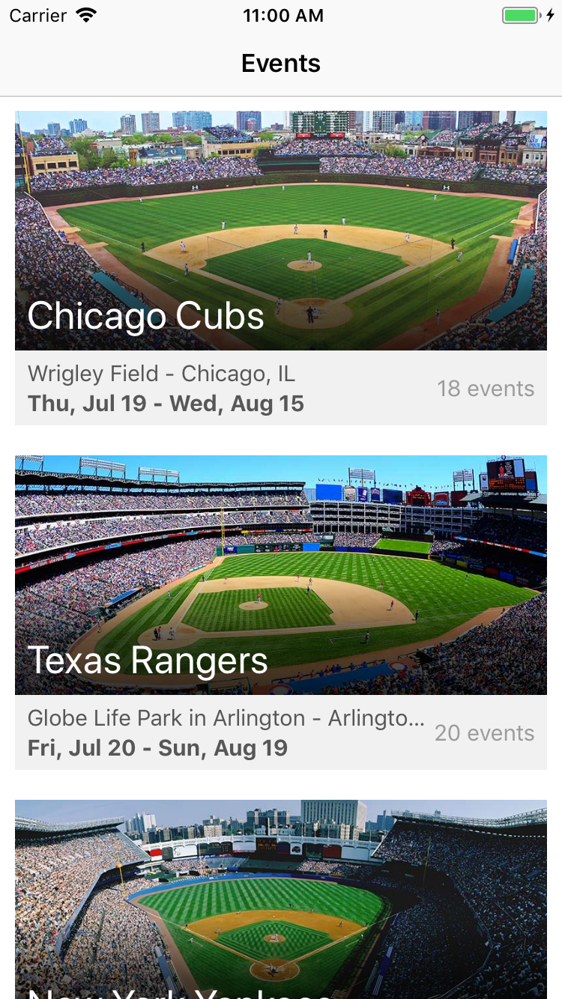

# iOS Coding Challenge 
> Mobile coding exercise for BairesDev.

On this coding exercise, the app fetch data from a REST API and populate a list on screen. While the scope of this task is small, this solution uses iOS best practices with scalability and testability in mind.

iPhone7 screenshot

iPadAir2 screenshot

iPadAir2 multitask screenshot

## Features

- Universal: it will run on any iOS device
- Localizable: its ready to support any future language 
- Multitask (on devices that support this feature)
- Works on any orientation because was implemented with CollectionView instead of TableView
- Responsive
- Solid MVC architecture
- Unit testing in all model and controller classes
- Save images into cache, reducing mobile data and batery usage

## Requirements

- iOS 11.0+
- Xcode 9.0+
- Swift 4.0+

## Installation

To reduce coupling, this solution keeps external libraries to a minimum using only:

* AlamoFire: an HTTP networking library used to perform HTTP requests.
* OHHTTPStubs: a library designed to stub network requests and improve unit testing. 

This app uses [CocoaPods](http://cocoapods.org/) as dependency manager. After downloading all project files you should perform the following command on the same directory.

	pod install

## Author

Pedro Neiva – pedro.neiva@gmail.com

